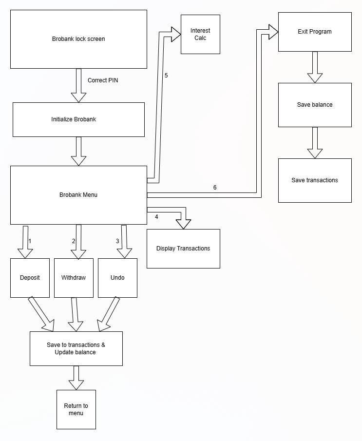

# Diagram or Visualization

Add at least one diagram or visualization in this folder. Examples include:

- BroBank module or function diagram
- FSM state diagram
- Memory or pointer diagram
- Abstract data type interface
- Queue or stack trace
- BFS or DFS flow

Use a clear filename such as `brobank-module-diagram.png`. Explain the diagram briefly in this file and link to it below.

The diagram is my program flowchart for my brobank code. It shows how brobank is suppose to work and the code written in 03-brobank implements it.

